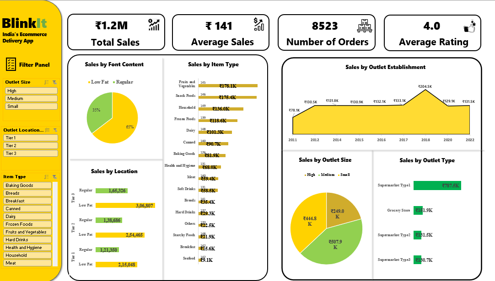

# BlinkIT Grocery Retail Analytics

Excel-based grocery retail sales analysis focused on understanding sales performance across product categories, outlet types, outlet sizes, location tiers, and outlet establishment years.

The project includes data cleaning, standardization, KPI development, PivotTable analysis, PivotCharts, slicers, and an interactive Excel dashboard to identify meaningful business patterns and insights.

---

## 🎯 Project Objective

The objective of this project is to analyze BlinkIT grocery retail data and identify:

- Major contributors to overall sales
- High-performing product categories
- Sales performance across outlet types and sizes
- Sales patterns across location tiers
- Differences between Low Fat and Regular products
- Sales trends based on outlet establishment year
- Differences between aggregate sales and sales per record
- Relationships between product and outlet characteristics

---

## 📂 Project Structure

```text
BlinkIT-Grocery-Retail-Analytics/
│
├── BlinkIT_Grocery_Analysis.xlsx
│
├── dashboard.png
│
└── README.md
```

---

## 🛠️ Tools & Skills

### Microsoft Excel

- Data Cleaning
- Data Formatting & Standardization
- Missing Value Handling
- Duplicate Detection
- Data Validation
- PivotTables
- PivotCharts
- Slicers
- KPI Development
- Data Analysis
- Comparative Analysis
- Dashboard Design
- Business Insight Generation

---

## 📈 KPIs

| KPI | Value |
|---|---:|
| **Total Sales** | ₹1.2M |
| **Average Sales per Record** | ₹141 |
| **Total Item Records** | 8,523 |
| **Unique Products** | 1,559 |
| **Total Outlets** | 10 |
| **Average Customer Rating** | 3.97 / 5 |
| **Average Item Visibility** | Overall Average |

> **Note:** "Total Item Records" is used instead of "Number of Orders" because the dataset does not contain a unique Order ID.

---

## ❓ Business Questions Answered

1. Which **item types** generate the highest sales?
2. Which **outlet type** contributes the most to total sales?
3. How does sales performance vary by **outlet size**?
4. Which **location tier** generates the highest sales?
5. How does sales differ between **Low Fat and Regular** products?
6. How does sales vary according to **outlet establishment year**?
7. Does **outlet type** show a significant difference in average sales?
8. Which product categories are the **major contributors to overall revenue**?
9. Is high total sales driven by **higher sales per record or greater representation**?
10. What patterns can be identified between **product characteristics and outlet characteristics**?

---

## 🔍 Analysis Areas

### Product Analysis

- Sales by item type
- Product category contribution
- Fat content comparison
- Product-level sales patterns

### Outlet Analysis

- Sales by outlet type
- Sales by outlet size
- Sales by outlet establishment year
- Average sales per record by outlet type

### Location Analysis

- Sales by location tier
- Comparison of outlet performance across location tiers

### Performance Analysis

- Total sales
- Average sales per record
- Revenue concentration
- Product and outlet representation

---
## 📊 Dashboard



---

## 💡 Key Insights

- **Supermarket Type 1** contributes the largest share of total sales, approximately **₹787.5K (~65.5%)**.
- **Fruits & Vegetables** is the highest-selling item category at approximately **₹178.1K**.
- **Snack Foods** follows closely at approximately **₹175.4K**.
- **Fruits & Vegetables and Snack Foods** together contribute roughly **29% of total sales**.
- **Tier 3 locations** generate the highest aggregate sales, approximately **₹472K**.
- **Medium-sized outlets** have the highest aggregate sales at approximately **₹507.9K**.
- **Low Fat products** account for approximately **65% of observed sales**.
- Outlets established in **2018** show the highest aggregate sales, approximately **₹204.5K**.
- Although **Supermarket Type 1** dominates total sales, average sales per record are relatively similar across outlet types.
- **Aggregate sales alone should not be used to judge outlet performance**; sales per record and outlet representation should also be considered.
- Revenue concentration is influenced by both **product mix and outlet representation**.
- The analysis provides areas for further investigation, particularly **product mix, outlet format, location tier, and item visibility**.

---


## 📌 Conclusion

This project demonstrates how **Microsoft Excel can be used for end-to-end retail data analysis**, from data cleaning and validation to KPI development, exploratory analysis, dashboard creation, and business insight generation.

The analysis highlights how **product mix, outlet characteristics, location, and representation** contribute to overall retail sales performance.

---

## 👤 Author

**Venket Ramana R S**